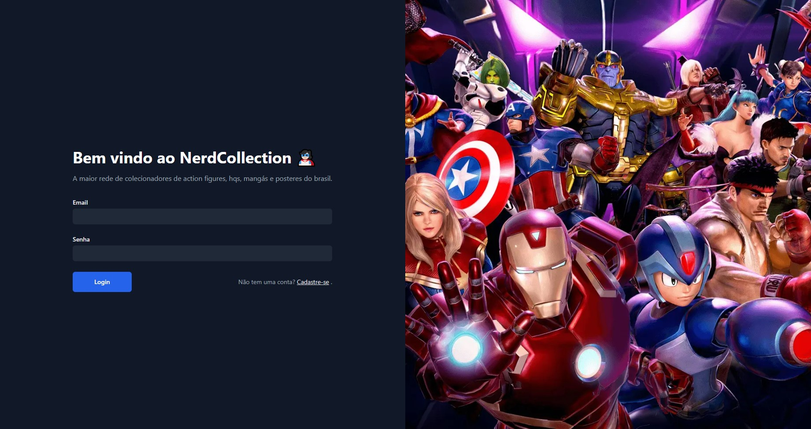

# Nerd Collection - NextJS

## 📖 Sobre 

  Projeto da faculdade de Análise e Desenvolvimento de Sistemas com intuíto de criar uma pseudo rede social para catalogar coleções e conectar colecionadores ao redor do mundo. Para esse projeto básico, que serve de um protótipo, foi utilizado Next13 com TailwindCSS e Phosphor Icons.

## Requisitos do Sistema

- [x] Catalogar seus próprios produtos
- [x] Avaliar e comentar
- [x] Pseudorede social
- [x] Próximos eventos
- [x] Perfil

## 🚀 Tecnologias

- NextJS 13
- Phoshpor Icons
- Tailwindcss

## 📦 Como baixar o projeto

   Clonar os repositórios
   
    $ git clone https://github.com/freitasDavi/projeto-nerd-v13
   
    # Instalar o node

    # Instalar as dependencias
  
    $ npm install
    
    # Inicializar a aplicação

    $ npm run dev

--- 

This is a [Next.js](https://nextjs.org/) project bootstrapped with [`create-next-app`](https://github.com/vercel/next.js/tree/canary/packages/create-next-app).

Open [http://localhost:3000](http://localhost:3000) with your browser to see the result.
